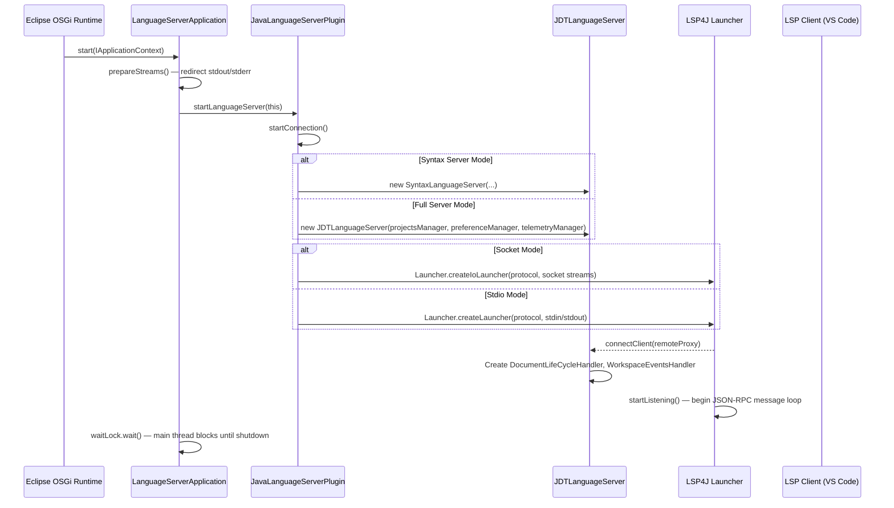
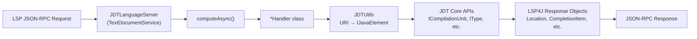
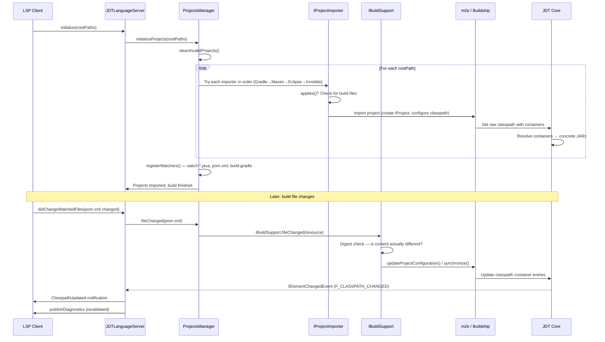
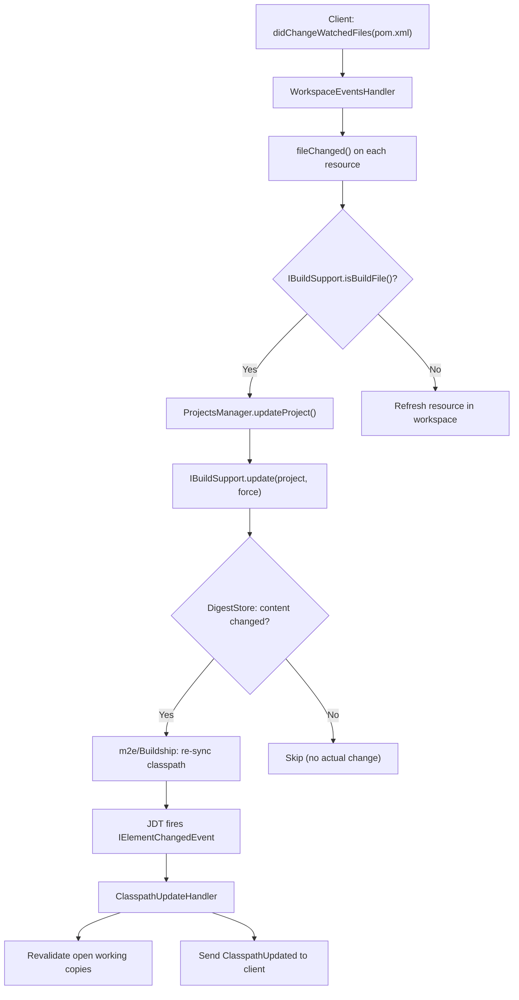

# Eclipse JDT Language Server — Architecture Documentation

> **Version**: Based on source analysis of `eclipse.jdt.ls` repository  
> **Last Updated**: March 2026

---

## Table of Contents

- [1. High-Level Architecture Overview](#1-high-level-architecture-overview)
  - [1.1 Module Structure](#11-module-structure)
  - [1.2 Server Modes](#12-server-modes)
  - [1.3 Startup Sequence](#13-startup-sequence)
  - [1.4 LSP Request Dispatch](#14-lsp-request-dispatch)
  - [1.5 Dependency Stack](#15-dependency-stack)
- [2. Eclipse JDT Core Data Model](#2-eclipse-jdt-core-data-model)
  - [2.1 IJavaElement Hierarchy](#21-ijavaelement-hierarchy)
  - [2.2 Working Copy Model](#22-working-copy-model)
  - [2.3 URI-to-IJavaElement Resolution](#23-uri-to-ijavaelement-resolution)
  - [2.4 AST Model vs Structural Model](#24-ast-model-vs-structural-model)
  - [2.5 Bindings](#25-bindings)
  - [2.6 LSP Wrapper Types](#26-lsp-wrapper-types)
  - [2.7 IResource Model (Eclipse Platform Layer)](#27-iresource-model-eclipse-platform-layer)
- [3. Classpath Architecture (Deep Dive)](#3-classpath-architecture-deep-dive)
  - [3.1 IClasspathEntry Model](#31-iclasspathentry-model)
  - [3.2 Classpath Resolution Flow](#32-classpath-resolution-flow)
  - [3.3 IBuildSupport System](#33-ibuildsupport-system)
  - [3.4 Maven Classpath Details](#34-maven-classpath-details)
  - [3.5 Gradle Classpath Details](#35-gradle-classpath-details)
  - [3.6 Invisible Project Mode](#36-invisible-project-mode)
  - [3.7 Classpath Commands](#37-classpath-commands)
- [4. Project Management Lifecycle](#4-project-management-lifecycle)
  - [4.1 Project Initialization](#41-project-initialization)
  - [4.2 File Watcher Registration](#42-file-watcher-registration)
  - [4.3 Project Update Flow](#43-project-update-flow)
- [5. LSP Handler Architecture](#5-lsp-handler-architecture)
  - [5.1 Handler Pattern](#51-handler-pattern)
  - [5.2 Key Handler Flows](#52-key-handler-flows)
  - [5.3 Document Lifecycle](#53-document-lifecycle)
  - [5.4 Full Handler Reference](#54-full-handler-reference)
- [6. Extension Point System](#6-extension-point-system)
- [7. Configuration and Preferences](#7-configuration-and-preferences)
- [8. Key Utility Classes](#8-key-utility-classes)

---

## 1. High-Level Architecture Overview

### 1.1 Module Structure

Eclipse JDT Language Server is an OSGi-based application composed of several bundles:

| Bundle | Purpose |
|--------|---------|
| `org.eclipse.jdt.ls.core` | Main server — all LSP handlers, project managers, build support, preferences, utilities |
| `org.eclipse.jdt.ls.filesystem` | Virtual filesystem abstraction for Eclipse metadata storage |
| `org.eclipse.jdt.ls.product` | Product definitions for packaging the full Language Server and Syntax Server distributions |
| `org.eclipse.jdt.ls.target` | Target platform definition — pins Eclipse Platform, JDT Core, m2e, Buildship versions |
| `org.eclipse.jdt.ls.repository` | P2 update site / repository definition for distributing the server |
| `org.eclipse.jdt.ls.tests` | Integration tests for the full language server |
| `org.eclipse.jdt.ls.tests.syntaxserver` | Tests specific to syntax-only server mode |

Nearly all logic resides in `org.eclipse.jdt.ls.core`. Its internal package structure:

```
org.eclipse.jdt.ls.core.internal/
├── handlers/              # 60+ LSP request handlers + JDTLanguageServer
├── managers/              # ProjectsManager, IBuildSupport, importers, classpath jobs
├── commands/              # BuildPathCommand, ProjectCommand, SourceAttachmentCommand
├── preferences/           # Preferences, PreferenceManager, ClientPreferences
├── contentassist/         # CompletionProposalRequestor, snippet engine
├── corrections/           # QuickFixProcessor, RefactorProcessor
├── javadoc/               # Javadoc-to-Markdown conversion
├── syntaxserver/          # SyntaxLanguageServer (lightweight mode)
├── JDTUtils.java          # URI↔IJavaElement conversion
├── ProjectUtils.java      # Project type detection, classpath queries
├── ResourceUtils.java     # File/resource utilities
└── JavaLanguageServerPlugin.java  # Plugin lifecycle
```

### 1.2 Server Modes

JDTLS runs in one of two modes, selected at startup via the `SYNTAXLS` environment variable:

| Mode | Application Class | Server Class | Projects Manager |
|------|-------------------|--------------|-----------------|
| **Full Language Server** | `LanguageServerApplication` | `JDTLanguageServer` | `StandardProjectsManager` |
| **Syntax Server** | `LanguageServerApplication` | `SyntaxLanguageServer` | `SyntaxProjectsManager` |

**Full Language Server** provides the complete feature set: completion, navigation, refactoring, diagnostics, Maven/Gradle build integration, and full classpath resolution.

**Syntax Server** is a lightweight mode that provides only syntax-level features (document symbols, basic completion, formatting, semantic tokens, hover) without full project import or build tool integration. VS Code uses both simultaneously — the syntax server provides fast initial feedback while the full server initializes in the background.

The mode is determined in `JavaLanguageServerPlugin.start()`:

```java
if (JDTEnvironmentUtils.isSyntaxServer()) {
    disableServices();
    preferenceManager = new PreferenceManager();
    projectsManager = new SyntaxProjectsManager(preferenceManager);
} else {
    preferenceManager = new StandardPreferenceManager();
    projectsManager = new StandardProjectsManager(preferenceManager);
}
```

### 1.3 Startup Sequence



Key startup classes:

| Class | Responsibility |
|-------|---------------|
| `LanguageServerApplication` | OSGi `IApplication` entry point; redirects I/O, blocks main thread |
| `JavaLanguageServerPlugin` | Plugin activator; creates server instance, establishes LSP4J connection |
| `BaseJDTLanguageServer` | Manages client connection, capability registration, `computeAsync()` template |
| `JDTLanguageServer` | Full LSP implementation (implements `LanguageServer`, `TextDocumentService`, `WorkspaceService`) |

### 1.4 LSP Request Dispatch

`JDTLanguageServer` implements three LSP4J interfaces:

- **`LanguageServer`** — `initialize()`, `initialized()`, `shutdown()`, `exit()`
- **`TextDocumentService`** — `completion()`, `hover()`, `definition()`, `references()`, `codeAction()`, `formatting()`, etc.
- **`WorkspaceService`** — `symbol()`, `executeCommand()`, `didChangeConfiguration()`, `didChangeWatchedFiles()`

Each LSP method delegates to a specialized `*Handler` class. The consistent dispatch pattern:

```java
@Override
public CompletableFuture<Hover> hover(HoverParams position) {
    HoverHandler handler = new HoverHandler(this.preferenceManager);
    return computeAsync((monitor) -> handler.hover(position, monitor));
}
```

The `computeAsync()` method (from `BaseJDTLanguageServer`) wraps handler execution in a `CompletableFuture` with cancellation support. Many handlers also call `waitForLifecycleJobs(monitor)` to ensure document state is synchronized before processing.



### 1.5 Dependency Stack

```
┌──────────────────────────────────────────────┐
│              LSP Client (VS Code)            │
├──────────────────────────────────────────────┤
│          LSP4J  (JSON-RPC / Protocol)        │
├──────────────────────────────────────────────┤
│     org.eclipse.jdt.ls.core  (JDTLS)        │
│   Handlers │ Managers │ Commands │ Utils     │
├──────────────────────────────────────────────┤
│       Eclipse JDT Core                       │
│  Compiler │ Java Model │ Search │ Refactor   │
├─────────────────┬────────────────────────────┤
│     m2e          │        Buildship           │
│ (Maven support)  │    (Gradle support)        │
├─────────────────┴────────────────────────────┤
│        Eclipse Platform                      │
│  OSGi │ IWorkspace │ IResource │ Jobs        │
├──────────────────────────────────────────────┤
│              JVM  (Java 17+)                 │
└──────────────────────────────────────────────┘
```

---

## 2. Eclipse JDT Core Data Model

JDTLS does **not** define its own Java data model. Instead, it wraps the **Eclipse JDT Core Java Model** — a structural, handle-based representation of Java source code that has been refined over 20+ years of Eclipse IDE development.

### 2.1 IJavaElement Hierarchy

All Java model elements implement `IJavaElement`. The hierarchy forms a tree mirroring the Java project structure:

```
IJavaElement (root interface — all Java model elements)
│
├── IJavaModel              The workspace root; contains all Java projects
│
├── IJavaProject            A Java project with classpath, source folders, output location
│   └── getResolvedClasspath() → IClasspathEntry[]
│
├── IPackageFragmentRoot    A source folder or library JAR/module root
│   ├── K_SOURCE            Source folder (e.g., src/main/java)
│   └── K_BINARY            JAR file or class folder
│
├── IPackageFragment        A Java package (e.g., com.example.util)
│
├── ITypeRoot (abstract)    Base for source and binary type containers
│   ├── ICompilationUnit    Editable .java source file (supports working copies)
│   └── IClassFile          Read-only .class binary file
│
├── IType                   Class, interface, enum, record, or annotation type declaration
│   ├── IMethod             Method or constructor
│   ├── IField              Field or enum constant
│   └── IInitializer        Static or instance initializer block
│
└── ILocalVariable          Local variable or method parameter
```

These are **handle objects** — lightweight references that may or may not correspond to an existing element. You call `element.exists()` to verify. The model is hierarchical: `IJavaProject` → `IPackageFragmentRoot` → `IPackageFragment` → `ICompilationUnit` → `IType` → `IMethod`/`IField`.

### 2.2 Working Copy Model

The working copy model is central to how JDTLS handles live editing. When a file is opened in the editor, JDTLS creates a **working copy** — an in-memory buffer that tracks unsaved changes.

- **`becomeWorkingCopy()`** — Creates an in-memory buffer from the on-disk source. Subsequent calls to `getSource()` return the buffer contents, not the file.
- **`applyTextEdit()`** / buffer modification — Applies incremental edits from `textDocument/didChange` notifications.
- **`reconcile()`** — Parses the modified buffer and updates the Java model (resolves types, computes errors). This triggers diagnostics.
- **`discardWorkingCopy()`** — Releases the buffer; future reads return on-disk content.

`DocumentLifeCycleHandler` orchestrates this lifecycle:

```
didOpen   → resolveCompilationUnit(uri) → unit.becomeWorkingCopy()
didChange → apply incremental TextEdits to working copy buffer
didSave   → reconcile working copy → trigger diagnostics
didClose  → unit.discardWorkingCopy()
```

### 2.3 URI-to-IJavaElement Resolution

`JDTUtils` is the bridge between LSP URIs and JDT model elements. The two core methods:

**`JDTUtils.resolveCompilationUnit(String uri)`**:
1. Parse the URI (`file://` or `jdt://`)
2. For `file://` URIs: find the `IFile` in the Eclipse workspace → get the `IJavaProject` → locate the `ICompilationUnit` for that file
3. For `jdt://` URIs: decode the content provider URI → resolve to `IClassFile` contents via `ContentProviderManager`
4. Returns `ICompilationUnit` (or `null` if the file is not on any project's classpath)

**`JDTUtils.resolveTypeRoot(String uri)`**:
- Returns either `ICompilationUnit` (for `.java` files) or `IClassFile` (for `.class` files / `jdt://` URIs)
- This is used by handlers that need to work with both source and binary types (e.g., hover, navigation)

**`JDTUtils.findElementAtSelection()`**:
- Given a `ITypeRoot` + line + column, uses `SelectionEngine` to resolve the `IJavaElement` at the cursor position
- Handles overloaded methods, generic types, and import statements

### 2.4 AST Model vs Structural Model

JDT provides two parallel representations:

| Java Model (`IJavaElement`) | AST (`ASTNode`) |
|---|---|
| Lightweight structural handles | Full syntax tree with every token |
| `IType`, `IMethod`, `IField` | `TypeDeclaration`, `MethodDeclaration`, `FieldDeclaration` |
| Handle-based (may not exist) | Computed on demand via `ASTParser` |
| Fast for navigation, outline | Required for refactoring, code analysis |
| Persistent across edits | Recomputed on each `reconcile()` |

The AST is obtained via `SharedASTProviderCore.getAST(unit)` or `ASTParser.createAST()`. Handlers that need deep code analysis (code actions, refactoring, inline hints) parse the AST. Handlers that need structural info (document symbols, code lens) use the Java model directly.

### 2.5 Bindings

When an AST is created with `resolveBindings=true`, each `ASTNode` is linked to a **binding** that provides resolved type information:

| Binding Interface | Connects To | Information |
|---|---|---|
| `ITypeBinding` | `TypeDeclaration`, type references | Fully-qualified name, superclass, interfaces, type parameters, package |
| `IMethodBinding` | `MethodDeclaration`, `MethodInvocation` | Parameter types, return type, exceptions, declaring class |
| `IVariableBinding` | `VariableDeclarationFragment`, `FieldAccess` | Type, declaring class, constant value, is-field |
| `IPackageBinding` | `PackageDeclaration` | Package name, module |
| `IAnnotationBinding` | `Annotation` | Annotation type, member-value pairs |

Bindings are essential for cross-file resolution. For example, when resolving `Go to Definition` on a method call, the `IMethodBinding.getJavaElement()` returns the `IMethod` in the target class, which is then converted to an LSP `Location`.

### 2.6 LSP Wrapper Types

JDTLS defines thin wrappers to pass JDT binding data through LSP protocol:

**`LspVariableBinding`** (in `JdtDomModels.java`):
```java
public static class LspVariableBinding {
    public String bindingKey;    // IBinding.getKey() — stable across sessions
    public String name;          // Variable/field name
    public String type;          // Type name
    public boolean isField;      // true for fields, false for locals
    public boolean isSelected;   // UI selection state
    public String[] parameters;  // For method-like signatures
}
```

**`LspMethodBinding`** (in `JdtDomModels.java`):
```java
public static class LspMethodBinding {
    public String bindingKey;    // IBinding.getKey()
    public String name;          // Method name
    public String[] parameters;  // Parameter type names
}
```

These are used by code generation handlers (generate getters/setters, constructors, hashCode/equals) where the client sends back selected bindings for the server to act on.

For standard LSP operations, JDT elements are converted directly to LSP4J types:
- `IJavaElement` → `Location` via `JDTUtils.toLocation(element)`
- `IType`/`IMethod`/`IField` → `SymbolInformation` or `DocumentSymbol`
- JDT `CompletionProposal` → LSP `CompletionItem` via `CompletionProposalRequestor`

### 2.7 IResource Model (Eclipse Platform Layer)

Underneath the Java model sits the Eclipse Platform **resource model**:

```
IWorkspaceRoot
├── IProject         ← mapped to IJavaProject (when Java nature is applied)
│   ├── IFolder      ← source folders, output folders
│   └── IFile        ← .java files mapped to ICompilationUnit
```

Relationship between layers:

| Eclipse Platform | JDT Java Model | Conversion |
|---|---|---|
| `IProject` | `IJavaProject` | `JavaCore.create(project)` |
| `IFile` (.java) | `ICompilationUnit` | `JavaCore.createCompilationUnitFrom(file)` |
| `IFile` (.class) | `IClassFile` | Via `IPackageFragmentRoot` |
| `IFolder` (src/) | `IPackageFragmentRoot` | Part of `IJavaProject.getPackageFragmentRoots()` |
| `IWorkspace` | `JavaModelManager` | Singleton managing all Java state |

JDTLS operates on the resources model for file watching and project lifecycle, and the Java model for all code intelligence operations.

---

## 3. Classpath Architecture (Deep Dive)

### 3.1 IClasspathEntry Model

Every `IJavaProject` has a **raw classpath** (`getRawClasspath()`) — an ordered array of `IClasspathEntry` objects describing where to find source and compiled code. Each entry has one of five kinds:

| Kind | Constant | Description | Example |
|------|----------|-------------|---------|
| **Source** | `CPE_SOURCE` | Source folders compiled by JDT | `src/main/java`, `src/test/java` |
| **Library** | `CPE_LIBRARY` | JAR files, class folders, JRT module images | `~/.m2/repository/guava-31.jar` |
| **Project** | `CPE_PROJECT` | Dependencies on other workspace projects | `/sibling-module` |
| **Variable** | `CPE_VARIABLE` | Path variables resolved at runtime | `M2_REPO/junit/junit/4.13/junit-4.13.jar` |
| **Container** | `CPE_CONTAINER` | Dynamically resolved classpath containers | `org.eclipse.jdt.launching.JRE_CONTAINER`, `org.eclipse.m2e.MAVEN2_CLASSPATH_CONTAINER` |

**Classpath containers** are the most important concept for build tool integration. A container is a named, lazily-resolved collection of classpath entries:

```
IJavaProject.getRawClasspath()
├── CPE_SOURCE: src/main/java
├── CPE_SOURCE: src/test/java
├── CPE_CONTAINER: org.eclipse.jdt.launching.JRE_CONTAINER
│   └── Resolves to: rt.jar, jce.jar, ... (or JRT modules for Java 9+)
├── CPE_CONTAINER: org.eclipse.m2e.MAVEN2_CLASSPATH_CONTAINER
│   └── Resolves to: guava-31.jar, jackson-core-2.15.jar, ...
└── CPE_CONTAINER: org.eclipse.buildship.core.gradleclasspathcontainer
    └── Resolves to: spring-core-6.0.jar, lombok-1.18.jar, ...
```

The **resolved classpath** (`getResolvedClasspath(true)`) expands all containers and variables into concrete `CPE_LIBRARY` and `CPE_SOURCE` entries.

### 3.2 Classpath Resolution Flow



**Step-by-step**:

1. **Project discovery**: `ProjectsManager.initializeProjects()` receives workspace root paths from the LSP `initialize` request.
2. **Importer selection**: Importers are tried in priority order (defined in `plugin.xml`): Gradle (300) → Maven (400) → Eclipse (1000) → Invisible (1500). The first importer whose `applies()` returns `true` handles the import.
3. **Project import**: The importer creates an `IProject` in the Eclipse workspace and configures its classpath:
   - **Maven**: m2e reads `pom.xml`, creates `IJavaProject` with `MAVEN2_CLASSPATH_CONTAINER`
   - **Gradle**: Buildship reads `build.gradle`, creates `IJavaProject` with Gradle classpath container
   - **Eclipse**: Reads `.classpath` file directly
   - **Invisible**: Creates a synthetic project wrapping standalone `.java` files
4. **Container resolution**: JDT Core lazily resolves `IClasspathContainer` instances — m2e resolves Maven dependencies from the local repository, Buildship resolves Gradle dependencies from the Gradle cache.
5. **Classpath change propagation**: `ClasspathUpdateHandler` (registered as `IElementChangedListener`) monitors `IJavaElementDelta` events with `F_CLASSPATH_CHANGED` or `F_RESOLVED_CLASSPATH_CHANGED` flags. On change, it sends `ClasspathUpdated` notifications to the client and revalidates open working copies.
6. **Incremental updates**: When build files change (`didChangeWatchedFiles`), the appropriate `IBuildSupport.update()` is invoked. A digest check (`DigestStore`) prevents redundant re-imports when file content hasn't actually changed.

### 3.3 IBuildSupport System

`IBuildSupport` is the abstraction for build tool integration:

```java
public interface IBuildSupport {
    boolean applies(IProject project);
    boolean isBuildFile(IResource resource);
    void update(IProject project, boolean force, IProgressMonitor monitor);
    void onWillUpdate(Collection<IProject> projects, IProgressMonitor monitor);
    boolean fileChanged(IResource resource, CHANGE_TYPE changeType, IProgressMonitor monitor);
    List<String> getWatchPatterns();
    void discoverSource(IClassFile classFile, IProgressMonitor monitor);
    String buildToolName();
}
```

Registered implementations (from `plugin.xml`, ordered by priority):

| Priority | Implementation | `applies()` | Watch Patterns | `buildToolName()` |
|----------|---------------|-------------|----------------|-------------------|
| 300 | `GradleBuildSupport` | `ProjectUtils.isGradleProject(project)` | `**/*.gradle`, `**/*.gradle.kts`, `**/gradle.properties` | `"Gradle"` |
| 400 | `MavenBuildSupport` | `ProjectUtils.isMavenProject(project)` | `**/pom.xml` | `"Maven"` |
| 1000 | `InvisibleProjectBuildSupport` | Not a visible project | (inherits from Eclipse) | `"Invisible"` |
| 2000 | `EclipseBuildSupport` | `true` (always applies — fallback) | `.classpath`, `.project`, `.factorypath`, `.settings/` | `"Eclipse"` |

`BuildSupportManager.find(project)` loads all implementations from the extension point and returns the first whose `applies()` matches.

### 3.4 Maven Classpath Details

Maven integration is provided by **m2e** (Maven2Eclipse). The flow:

1. `MavenProjectImporter.importToWorkspace()` scans for `pom.xml` files, calls `ProjectConfigurationManager.importProjects()` to create Eclipse projects with Maven nature.
2. m2e sets `MAVEN2_CLASSPATH_CONTAINER` (`org.eclipse.m2e.MAVEN2_CLASSPATH_CONTAINER`) on each `IJavaProject`.
3. The container resolves `pom.xml` dependencies via the local Maven repository (`~/.m2/repository`). It includes compile-scope, runtime-scope, and optionally test-scope dependencies as `CPE_LIBRARY` entries.
4. When `pom.xml` changes, `MavenBuildSupport.update()`:
   - Uses `DigestStore` to check if the file actually changed (avoids redundant updates)
   - For multi-module projects, recursively collects all affected modules via `collectProjects()`
   - Calls `ProjectConfigurationManager.updateProjectConfiguration(MavenUpdateRequest)` to re-resolve dependencies
   - m2e triggers a container update → JDT fires `F_CLASSPATH_CHANGED`
5. `MavenSourceDownloader` handles source JAR attachment — downloading `-sources.jar` artifacts and attaching them to library entries.

**Multi-module projects**: `MavenBuildSupport.collectProjects()` walks module declarations in parent POMs to find all sub-projects, then updates them atomically.

### 3.5 Gradle Classpath Details

Gradle integration is provided by **Buildship** (Eclipse Gradle Tooling). The flow:

1. `GradleProjectImporter.importToWorkspace()` detects `build.gradle`, `build.gradle.kts`, `settings.gradle`, or `settings.gradle.kts`. Creates a `BuildConfiguration` and calls `GradleCore.getWorkspace().createBuild()`.
2. Buildship synchronizes the Gradle project model → creates Eclipse projects with Gradle classpath container (`org.eclipse.buildship.core.gradleclasspathcontainer`).
3. When build files change, `GradleBuildSupport.update()`:
   - Checks digests for `build.gradle`, `settings.gradle`, and their `.kts` variants
   - Calls `gradleBuild.synchronize(monitor)` to re-sync from Gradle daemon
   - Syncs annotation processing configuration separately
4. JDTLS ships custom **Gradle init scripts** (`org.eclipse.jdt.ls.core/gradle/`) for special project types:
   - `android/init.gradle` — Android project support
   - `kotlin/init.gradle` — Kotlin plugin classpath
   - `groovy/init.gradle` — Groovy plugin classpath
   - `protobuf/init.gradle` — Protocol Buffers generated sources
   - `apt/init.gradle` — Annotation processing configuration
   - `aspectj/init.gradle` — AspectJ support

### 3.6 Invisible Project Mode

When no build descriptor (`pom.xml`, `build.gradle`, `.project`) is detected, JDTLS creates an **invisible project** to provide code intelligence for standalone `.java` files.

**How it works**:

1. `InvisibleProjectImporter` creates a synthetic Eclipse project (name derived from workspace root path hash).
2. A symbolic link (`_` folder) is created inside the project pointing to the actual workspace root.
3. `InvisibleProjectBuildSupport` configures the classpath:
   - **Source folders**: Inferred from Java package declarations in `.java` files, or configured via `BuildPathCommand.addToSourcePath()`
   - **Libraries**: Scanned using glob patterns from the `java.project.referencedLibraries` setting (default: `lib/**`)
   - **JDK**: Selected from `java.configuration.runtimes` → `JRE_CONTAINER`
4. `UpdateClasspathJob` handles JAR detection:
   - `ProjectUtils.collectBinaries()` walks the workspace root matching include/exclude glob patterns
   - `ProjectUtils.detectSources()` looks for source JARs using naming conventions (`foo-sources.jar` for `foo.jar`)
   - Creates `CPE_LIBRARY` entries for each discovered JAR

**Limitations vs Maven/Gradle mode**:
- No dependency resolution — only JARs physically in the workspace are found
- No transitive dependency management
- No build lifecycle (compile, test, package)
- Source/test separation requires manual configuration

### 3.7 Classpath Commands

JDTLS exposes several LSP commands for classpath inspection and management:

| Command | Class | Purpose |
|---------|-------|---------|
| `java.project.listSourcePaths` | `BuildPathCommand.listSourcePaths()` | List all source folders across all projects |
| `java.project.addToSourcePath` | `BuildPathCommand.addToSourcePath(uri)` | Add a folder as a source root (invisible/Eclipse projects only) |
| `java.project.removeFromSourcePath` | `BuildPathCommand.removeFromSourcePath(uri)` | Remove a source folder |
| `java.project.getSettings` | `ProjectCommand.getProjectSettings(uri, keys)` | Query: source paths, output path, VM location, referenced libraries, classpath entries |
| `java.project.updateClassPaths` | `ProjectCommand.updateClasspaths(uri, entries)` | Update classpath with new entries |
| `java.project.updateSourceAttachment` | `SourceAttachmentCommand` | Attach/update source JARs for a library entry |
| `java.project.getAll` | `ProjectCommand.getAllProjects()` | List all workspace projects |

`BuildPathCommand` operations are restricted to Eclipse and invisible projects — Maven and Gradle projects should have their classpath managed through their respective build files.

---

## 4. Project Management Lifecycle

### 4.1 Project Initialization

`StandardProjectsManager` orchestrates the full project lifecycle:

```java
public void initializeProjects(Collection<IPath> rootPaths, IProgressMonitor monitor) {
    // 1. Clean stale projects from previous sessions
    cleanInvalidProjects(rootPaths, monitor);

    // 2. Try importers in priority order for each root path
    for (IPath rootPath : rootPaths) {
        for (IProjectImporter importer : importers()) {
            importer.initialize(rootPath.toFile());
            if (importer.applies(monitor)) {
                importer.importToWorkspace(monitor);
                if (importer.isResolved(rootPath.toFile())) break;
            }
        }
    }
}
```

Importers are loaded from the `org.eclipse.jdt.ls.core.importers` extension point:

| Priority | Importer | Detects |
|----------|----------|---------|
| 300 | `GradleProjectImporter` | `build.gradle`, `settings.gradle`, `.kts` variants |
| 400 | `MavenProjectImporter` | `pom.xml` |
| 1000 | `EclipseProjectImporter` | `.project` + `.classpath` files |
| 1500 | `InvisibleProjectImporter` | Fallback for any remaining `.java` files |

### 4.2 File Watcher Registration

After project initialization, `StandardProjectsManager.registerWatchers()` registers file system watchers with the LSP client. This allows the client to notify the server when relevant files change.

**Base patterns** (always watched):
- `**/*.java` — Java source files
- `**/.project`, `**/.classpath` — Eclipse project files
- `**/.settings/*.prefs` — Eclipse settings
- `**/src/**` — Source folder contents

**Build-tool patterns** (added per `IBuildSupport.getWatchPatterns()`):
- Maven: `**/pom.xml`
- Gradle: `**/*.gradle`, `**/*.gradle.kts`, `**/gradle.properties`

**Dynamic patterns**:
- Non-standard source folders discovered from classpath entries
- Library JARs referenced in classpath
- Invisible project referenced library glob patterns
- Formatter settings files and settings URLs

Watchers are registered via `workspace/didChangeWatchedFiles` dynamic registration. If patterns change (e.g., after adding a new source folder), watchers are re-registered.

### 4.3 Project Update Flow

When a build file changes:



`ProjectsManager.updateProject()` wraps the update in a `WorkspaceJob` and calls `IBuildSupport.update()`. The digest-based change detection (`DigestStore`) is a crucial optimization — it prevents expensive Maven/Gradle re-syncs when a build file was merely touched without changing content (common with editors that auto-save).

---

## 5. LSP Handler Architecture

### 5.1 Handler Pattern

JDTLS uses a consistent pattern for all LSP requests:

1. `JDTLanguageServer` receives the LSP method call
2. A handler instance is created (most handlers are stateless and instantiated per-request)
3. The handler is invoked inside `computeAsync()`, which provides a `CancelChecker`-backed `IProgressMonitor`
4. The handler uses `JDTUtils` to resolve the URI to an `IJavaElement`
5. The handler calls JDT Core APIs
6. Results are converted to LSP4J types and returned

```java
// Typical pattern:
@Override
public CompletableFuture<List<? extends Location>> references(ReferenceParams params) {
    ReferencesHandler handler = new ReferencesHandler(this.preferenceManager);
    return computeAsync((monitor) -> handler.findReferences(params, monitor));
}
```

Some handlers (`CodeActionHandler`) use a synchronized lock to prevent concurrent modification issues:
```java
@Override
public CompletableFuture<List<Either<Command, CodeAction>>> codeAction(CodeActionParams params) {
    CodeActionHandler handler = new CodeActionHandler(this.preferenceManager);
    return computeAsync((monitor) -> {
        waitForLifecycleJobs(monitor);
        synchronized (codeActionLock) {
            return handler.getCodeActionCommands(params, monitor);
        }
    });
}
```

### 5.2 Key Handler Flows

#### Completion Flow

```
CompletionParams(uri, position)
    → CompletionHandler.completion()
        → JDTUtils.resolveCompilationUnit(uri) → ICompilationUnit
        → unit.codeComplete(offset, CompletionProposalRequestor)
            → JDT's completion engine analyzes scope, types, visibility
            → CompletionProposalRequestor collects CompletionProposal[]
        → Convert each proposal → LSP CompletionItem
            → Label, kind, insertText, textEdit, additionalTextEdits
            → Snippet support for method signatures
        → Return CompletionList (isIncomplete flag for pagination)

CompletionItem/resolve:
    → CompletionResolveHandler.resolve()
        → Retrieve stored data from CompletionItem.data
        → Compute documentation (Javadoc), detail, additionalTextEdits
        → Return enriched CompletionItem
```

#### Diagnostics Flow

```
File save or reconcile event
    → DiagnosticsHandler.createDiagnostics()
        → ICompilationUnit.reconcile() runs JDT compiler
        → Collect IProblem[] from reconcile result
        → Convert each IProblem → LSP Diagnostic
            → Range (line/column), severity, message, code
        → Connection.publishDiagnostics(uri, diagnostics)

Workspace-level:
    → WorkspaceDiagnosticsHandler (IResourceChangeListener)
        → Monitors IMarker changes across all projects
        → Publishes diagnostics for files with changed markers
```

#### Navigation Flow (Definition / References)

```
Definition:
    DefinitionParams(uri, position)
        → NavigateToDefinitionHandler.definition()
            → JDTUtils.findElementAtSelection(typeRoot, line, column)
                → SelectionEngine resolves element at cursor
            → IJavaElement resolved (IMethod, IType, IField, etc.)
            → JDTUtils.toLocation(element) → Location(uri, range)

References:
    ReferenceParams(uri, position, includeDeclaration)
        → ReferencesHandler.findReferences()
            → Resolve IJavaElement at position
            → SearchEngine.search(SearchPattern, SearchRequestor)
                → JDT index-based search across all projects
            → Collect matches → Location[]
```

#### Code Actions Flow

```
CodeActionParams(uri, range, diagnostics)
    → CodeActionHandler.getCodeActionCommands()
        → Resolve ICompilationUnit, parse AST
        → For each diagnostic in range:
            → QuickFixProcessor.getCorrections() → quick fixes
        → RefactorProcessor.getProposals() → refactoring proposals
            → Extract variable, extract method, inline, convert, etc.
        → SourceAssistProcessor → source actions
            → Organize imports, generate getters/setters, etc.
        → Convert IProposal[] → CodeAction[]
```

### 5.3 Document Lifecycle

`DocumentLifeCycleHandler` manages the lifecycle of open documents:

| LSP Event | Handler Method | Java Model Operation |
|-----------|---------------|---------------------|
| `didOpen` | `handleOpen()` | `resolveCompilationUnit(uri)` → `unit.becomeWorkingCopy()` → initial reconcile → publish diagnostics |
| `didChange` | `handleChanged()` | Apply `TextDocumentContentChangeEvent[]` to buffer → reconcile (debounced) → publish diagnostics |
| `didSave` | `handleSaved()` | Reconcile → trigger build → update markers → refresh diagnostics |
| `didClose` | `handleClosed()` | `unit.discardWorkingCopy()` → clear published diagnostics |

When a file is opened that doesn't belong to any visible project, `resolveCompilationUnit()` triggers the invisible project system — creating a synthetic project, inferring the source root from the package declaration, and configuring the classpath.

### 5.4 Full Handler Reference

| LSP Request | Handler Class | Notes |
|-------------|--------------|-------|
| `textDocument/completion` | `CompletionHandler` | Synchronous in default mode; `CompletionProposalRequestor` |
| `completionItem/resolve` | `CompletionResolveHandler` | Loads Javadoc, additional edits |
| `textDocument/hover` | `HoverHandler` | Javadoc + type signature via `HoverInfoProvider` |
| `textDocument/definition` | `NavigateToDefinitionHandler` | `findElementAtSelection()` |
| `textDocument/typeDefinition` | `NavigateToTypeDefinitionHandler` | Resolves to declaring type |
| `textDocument/declaration` | `NavigateToDeclarationHandler` | |
| `textDocument/references` | `ReferencesHandler` | JDT `SearchEngine` |
| `textDocument/implementation` | `ImplementationsHandler` | Type hierarchy search |
| `textDocument/documentHighlight` | `DocumentHighlightHandler` | Occurrence marking |
| `textDocument/documentSymbol` | `DocumentSymbolHandler` | Outline tree |
| `textDocument/codeAction` | `CodeActionHandler` | Quick fixes + refactorings |
| `codeAction/resolve` | `CodeActionResolveHandler` | Lazy workspace edit computation |
| `textDocument/codeLens` | `CodeLensHandler` | References count, implementations count |
| `textDocument/formatting` | `FormatterHandler` | Eclipse formatter engine |
| `textDocument/rangeFormatting` | `FormatterHandler` | |
| `textDocument/onTypeFormatting` | `FormatterHandler` | |
| `textDocument/rename` | `RenameHandler` | JDT refactoring engine |
| `textDocument/prepareRename` | `PrepareRenameHandler` | Validate rename feasibility |
| `textDocument/signatureHelp` | `SignatureHelpHandler` | Active parameter tracking |
| `textDocument/foldingRange` | `FoldingRangeHandler` | Import groups, methods, comments |
| `textDocument/selectionRange` | `SelectionRangeHandler` | Smart expand/shrink selection |
| `textDocument/semanticTokens/full` | `SemanticTokensHandler` | Token classification |
| `textDocument/inlayHint` | `InlayHintsHandler` | Parameter name hints |
| `textDocument/prepareCallHierarchy` | `CallHierarchyHandler` | |
| `textDocument/prepareTypeHierarchy` | `TypeHierarchyHandler` | |
| `workspace/symbol` | `WorkspaceSymbolHandler` | Index-based search |
| `workspace/executeCommand` | `WorkspaceExecuteCommandHandler` | Delegates to `IDelegateCommandHandler` |
| `workspace/didChangeWatchedFiles` | `WorkspaceEventsHandler` | Build file change detection |
| `workspace/didChangeWorkspaceFolders` | `WorkspaceFolderChangeHandler` | Multi-root workspace support |
| `workspace/willRenameFiles` | `FileEventHandler` | Package rename refactoring |
| `java/buildWorkspace` | `BuildWorkspaceHandler` | Full/incremental rebuild |
| `java/organizeImports` | `OrganizeImportsHandler` | |
| `java/generateHashCodeEquals` | `HashCodeEqualsHandler` | |
| `java/generateToString` | `GenerateToStringHandler` | |
| `java/generateAccessors` | `GenerateAccessorsHandler` | Getters/setters |
| `java/generateConstructors` | `GenerateConstructorsHandler` | |
| `java/generateDelegateMethods` | `GenerateDelegateMethodsHandler` | |

---

## 6. Extension Point System

JDTLS defines four extension points, enabling third-party plugins to extend the server's capabilities:

### Build Support (`org.eclipse.jdt.ls.core.buildSupport`)

Register additional build tool support. Schema: `org.eclipse.jdt.ls.core.buildSupport.exsd`

```xml
<extension point="org.eclipse.jdt.ls.core.buildSupport">
    <buildSupport id="myBuildSupport" order="250"
        class="com.example.MyBuildSupport"/>  <!-- implements IBuildSupport -->
</extension>
```

**Default registrations**: GradleBuildSupport (300), MavenBuildSupport (400), InvisibleProjectBuildSupport (1000), EclipseBuildSupport (2000).

### Project Importers (`org.eclipse.jdt.ls.core.importers`)

Register project importers that detect and import projects from a workspace root. Schema: `org.eclipse.jdt.ls.core.importers.exsd`

```xml
<extension point="org.eclipse.jdt.ls.core.importers">
    <importer id="myImporter" order="350"
        class="com.example.MyProjectImporter"/>  <!-- implements IProjectImporter -->
</extension>
```

**Default registrations**: GradleProjectImporter (300), MavenProjectImporter (400), EclipseProjectImporter (1000), InvisibleProjectImporter (1500).

### Content Providers (`org.eclipse.jdt.ls.core.contentProvider`)

Register source/decompiler providers for `.class` files. Schema: `org.eclipse.jdt.ls.core.contentProvider.exsd`

```xml
<extension point="org.eclipse.jdt.ls.core.contentProvider">
    <contentProvider id="myDecompiler" priority="100"
        class="com.example.MyDecompiler"          <!-- implements IDecompiler -->
        uriPattern=".+\.class.*"/>
</extension>
```

**Default registrations**: `SourceContentProvider` (priority 0 — serves attached source JARs), `FernFlowerDecompiler` (priority `Integer.MAX_VALUE` — fallback decompiler for classes without source).

`ContentProviderManager` selects providers by matching URI patterns and sorting by priority. This enables extensions like Procyon or CFR decompilers.

### Delegate Command Handlers (`org.eclipse.jdt.ls.core.delegateCommandHandler`)

Register custom commands accessible via `workspace/executeCommand`. Schema: `org.eclipse.jdt.ls.core.delegateCommandHandler.exsd`

```xml
<extension point="org.eclipse.jdt.ls.core.delegateCommandHandler">
    <delegateCommandHandler class="com.example.MyCommandHandler">
        <command id="myExtension.customCommand"/>
    </delegateCommandHandler>
</extension>
```

`WorkspaceExecuteCommandHandler` routes incoming `executeCommand` requests to the registered `IDelegateCommandHandler` by matching the command ID. The default JDTLS plugin registers 30+ delegate commands covering: organize imports, source attachment, classpath management, project settings, type hierarchy, decompilation, and more.

---

## 7. Configuration and Preferences

### Preference Architecture

```
┌───────────────┐     ┌────────────────┐     ┌──────────────────────┐
│ LSP Client    │────▶│PreferenceManager│────▶│ Preferences          │
│ (settings.json│     │                │     │ - importGradleEnabled │
│  / didChange  │     │ Listeners:     │     │ - importMavenEnabled  │
│  Configuration)     │ IBuildSupport  │     │ - referencedLibraries │
└───────────────┘     │ JVMConfigurator│     │ - runtimes            │
                      │ InvisibleProj  │     │ - javaHome            │
                      └────────────────┘     │ - mavenUserSettings   │
                             │               │ - gradleHome, ...     │
                      ┌──────▼───────┐       └──────────────────────┘
                      │ClientPreferences│
                      │ - completion   │
                      │ - formatting   │
                      │ - codeLens     │
                      │ - workspace    │
                      └────────────────┘
```

### Key Settings Affecting Classpath

| Setting | Type | Effect |
|---------|------|--------|
| `java.configuration.runtimes` | `RuntimeEnvironment[]` | JDK installations; used to configure `JRE_CONTAINER` per project |
| `java.jdt.ls.java.home` | `string` | JDK running the language server itself |
| `java.project.referencedLibraries` | `ReferencedLibraries` | Glob patterns for invisible project JAR detection (default: `lib/**`) |
| `java.import.maven.enabled` | `boolean` | Enable/disable Maven project import |
| `java.import.gradle.enabled` | `boolean` | Enable/disable Gradle project import |
| `java.import.maven.offline` | `boolean` | Maven offline mode |
| `java.import.gradle.home` | `string` | Gradle installation directory |
| `java.import.gradle.java.home` | `string` | JDK for running Gradle daemon |
| `java.import.gradle.wrapper.enabled` | `boolean` | Use Gradle wrapper if available |
| `java.autobuild.enabled` | `boolean` | Auto-build on file save |

### ReferencedLibraries Configuration

For invisible projects (standalone `.java` files), `java.project.referencedLibraries` controls which JARs are added to the classpath:

```json
{
    "java.project.referencedLibraries": {
        "include": ["lib/**/*.jar", "vendor/**/*.jar"],
        "exclude": ["lib/test/**"],
        "sources": {
            "lib/mylib.jar": "lib/mylib-src.jar"
        }
    }
}
```

- **`include`**: Glob patterns relative to workspace root (default: `lib/**`)
- **`exclude`**: Patterns to exclude from include matches
- **`sources`**: Explicit binary-to-source JAR mappings

`UpdateClasspathJob` processes these patterns via `ProjectUtils.collectBinaries()` and creates `CPE_LIBRARY` entries.

---

## 8. Key Utility Classes

### JDTUtils

The most critical utility class — bridges LSP URIs and JDT model elements.

| Method | Purpose |
|--------|---------|
| `resolveCompilationUnit(uri)` | URI → `ICompilationUnit` (working copy or file) |
| `resolveTypeRoot(uri)` | URI → `ICompilationUnit` or `IClassFile` |
| `resolveClassFile(uri)` | URI → `IClassFile` (binary type) |
| `findElementAtSelection(typeRoot, line, col)` | Finds `IJavaElement` at cursor position using `SelectionEngine` |
| `toLocation(IJavaElement)` | JDT element → LSP `Location` (uri + range) |
| `toRange(openable, offset, length)` | Byte offset → LSP `Range` (line/character) |
| `toURI(ICompilationUnit)` | Compilation unit → `file://` URI |
| `toUri(IClassFile)` | Class file → `jdt://` content provider URI |
| `getFileURI(IResource)` | Eclipse resource → `file://` URI |

### ProjectUtils

Project type detection and classpath queries.

| Method | Purpose |
|--------|---------|
| `isJavaProject(project)` | Has Java nature? |
| `isMavenProject(project)` | Has Maven nature? |
| `isGradleProject(project)` | Has Gradle nature? |
| `isVisibleProject(project)` | Not an invisible/synthetic project? |
| `isGeneralJavaProject(project)` | Java project without Maven/Gradle (can be manually configured) |
| `listSourcePaths(javaProject)` | Returns all `CPE_SOURCE` entry paths |
| `collectBinaries(root, include, exclude)` | Glob-pattern JAR discovery for invisible projects |
| `addSourcePath(path, javaProject)` | Add a source folder to classpath |
| `getProjectRealFolder(project)` | Resolves linked folder to real filesystem path |

### ResourceUtils

File and resource conversion utilities.

| Method | Purpose |
|--------|---------|
| `filePathFromURI(uri)` | URI string → `IPath` |
| `canonicalFilePathFromURI(uri)` | URI → canonical filesystem path |
| `toGlobPattern(path)` | Filesystem path → LSP glob pattern for file watching |
| `isContainedIn(path, paths)` | Check if path is under any of the given paths |

### DigestStore

Optimization layer that prevents redundant build file re-processing.

| Method | Purpose |
|--------|---------|
| `updateDigest(Path)` | Compute SHA-256 of file content; returns `true` if changed since last check |

Used by `MavenBuildSupport` and `GradleBuildSupport` to skip expensive re-syncs when a file watcher fires but the file content hasn't actually changed.
